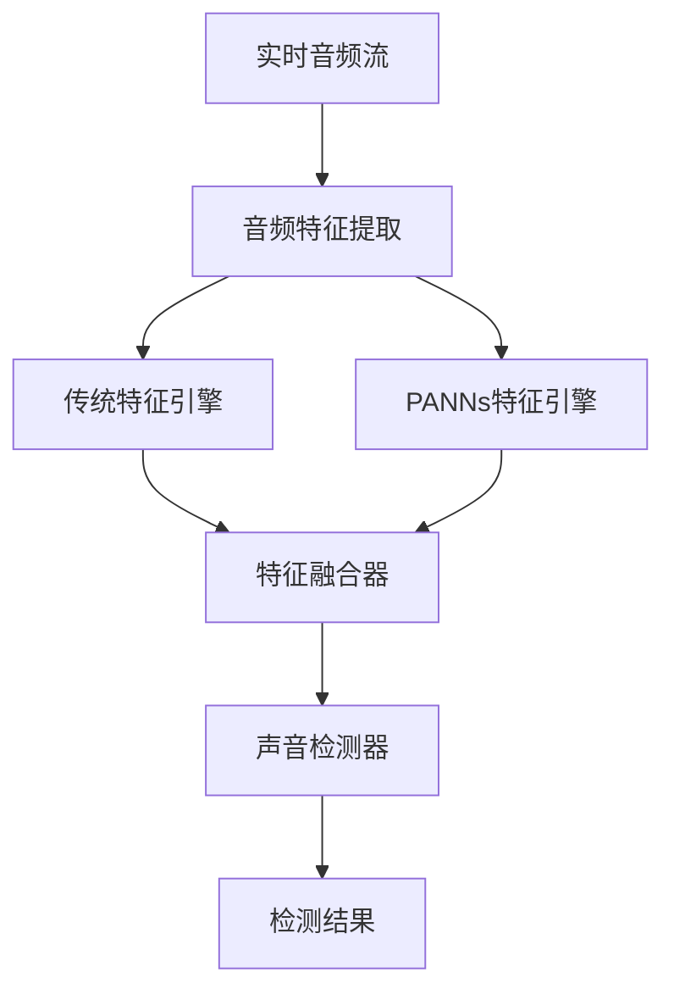

# PANNs 音频检测使用说明

## 简介

本项目基于 PANNs (Pretrained Audio Neural Networks) 技术，对 `detector_system_audio.py` 进行了增强，实现了更精确的音频检测功能。通过融合传统音频特征和深度学习模型，大幅提升了目标音频检测的准确性和鲁棒性。

## 功能特性

1. **双模式检测**：
   - 传统音频特征检测（MFCC、频谱质心、色度特征等）
   - PANNs深度学习模型检测
   - 智能特征融合，提高检测准确性

2. **自适应权重调整**：
   - 根据置信度质量动态调整传统特征和PANNs特征的权重
   - 置信度增强策略，进一步提升检测效果

3. **兼容性设计**：
   - 自动检测系统是否支持PANNs（CUDA/MPS/CPU）
   - 出错时自动降级到传统检测方法
   - 保持与原有功能的完全兼容

## 使用方法

### 1. 基本使用

```bash
# 使用默认设备检测 target.wav
python ../voice4/detector_system_audio.py target.wav

# 使用指定设备检测
python ../voice4/detector_system_audio.py target.wav --input 1

# 启用调试模式查看详细信息
python ../voice4/detector_system_audio.py target.wav --debug

# 列出所有可用音频设备
python ../voice4/detector_system_audio.py --list-devices
```

### 2. 配置文件设置

在 `config.py` 中可以调整以下参数：

```python
# 启用PANNs检测
'detection': {
    'enable_panns': True,  # 启用PANNs检测
    'min_confidence': 0.8,  # 检测阈值
    # ... 其他参数
}
```

### 3. 检测结果说明

检测结果包含以下信息：
- 传统特征置信度 (`traditional_confidence`)
- PANNs特征置信度 (`panns_confidence`)
- 音频电平 (`audio_level`)
- 详细相似度信息

## 技术架构

### 核心模块

1. **PANNsFeatureEngine** (`panns_features.py`)：
   - PANNs模型加载和特征提取
   - 音频预处理和重采样
   - 置信度计算

2. **FeatureFusionEngine** (`feature_fusion.py`)：
   - 传统特征和PANNs特征的融合
   - 自适应权重调整
   - 置信度增强策略

### 工作流程



## 性能优化

1. **模型缓存**：使用LRU缓存机制避免重复加载模型
2. **设备自适应**：智能选择CUDA/MPS/CPU运行环境
3. **内存优化**：特征缓存和内存管理优化
4. **计算优化**：异步处理和批量计算

## 故障处理

1. **PANNs不可用**：
   - 自动降级到传统检测方法
   - 输出警告信息但不影响程序运行

2. **特征提取失败**：
   - 单次特征提取失败不会影响整体检测
   - 记录错误日志供后续分析

3. **资源不足**：
   - 内存不足时自动调整模型参数
   - CPU占用过高时降低处理频率

## 开发指南

### 添加新的特征提取器

1. 在 `panns_features.py` 中扩展 `PANNsFeatureEngine` 类
2. 实现新的特征提取方法
3. 在 `feature_fusion.py` 中调整融合策略

### 调整融合策略

1. 修改 `FeatureFusionEngine` 中的权重参数
2. 实现新的自适应权重算法
3. 测试不同场景下的检测效果

## 注意事项

1. 首次运行时需要下载PANNs预训练模型
2. PANNs检测需要足够的系统资源（推荐4GB以上内存）
3. 在资源受限的设备上建议使用传统检测方法
4. 保持音频输入设备的正常连接和权限设置

## 版本信息

- PANNs模型版本：CNN14
- 支持的音频格式：WAV, MP3, FLAC等常见格式
- 系统要求：Python 3.7+, PyTorch 1.8+